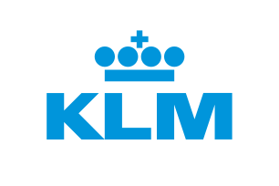

# Dictionary of abbreviations and definitions used in KLM

 

In [Apple](https://support.apple.com/en-gu/guide/dictionary/welcome/mac) &
[XDXF](https://github.com/soshial/xdxf_makedict/tree/master/format_standard) formats.

## Installation on macOs

Copy'n'paste this 2 lines in Terminal.app:

```sh
mkdir -p "$HOME/Library/Dictionaries"
curl -sSL https://github.com/aleksandr-vin/klm-dictionary/releases/latest/download/KLM.dictionary.zip \
  | bsdtar -xvf- -C "$HOME/Library/Dictionaries"
```

Then open Dictionary.app, go to _Preferences_ (`Cmd` + `,`) and enable _KLM_ dictionary (it will appear as last one). Check _Hints_ section down.

Or do the same steps manually:

1. Download release
2. Unpack into `${HOME}/Library/Dictionaries/` (create directory if needed)

### Hints

1. In _Preferences_ of Dictionary.app you can drag the _KLM_ entry to the top to make it first priority.
2. You can _Look Up_ words from any place: force-push the word or control-click selected text. Then, in the contextual
   menu that appears, choose Look Up.
3. If you want to add or change a record in this dictionary, please do make a Pull Request or crate an Issue or send me a message!

## Development

The source is in [XSXF format](https://github.com/soshial/xdxf_makedict/tree/master/format_standard) which is converted to
Apple Dictionary format with the help of [PyGlossary](https://github.com/ilius/pyglossary) and then slightly tuned
(see [build.sh](build.sh)).

NOTE: XDXF is not fully supported by PyGlossary, so be carefull – don't overcomplicate.

### Formatting Raw Input

#### From Confluence

If you copy text from Confluence tables of 3 columns (Abbr, Name, Description), then you can use `formatter.sh` script to
create `<ar>` entries for XDXF file.

### Setup

Run `./setup.sh`, you'll need Python 3.

### Building

Run `./build.sh`.

You'll get sources for creating Apple Dictionary at `Dictionary/` and the result at `objects/KLM.dictionary`.

### Installing to User's Dictionaries

Run `./install.sh`.

### Resources

1. [Apple Dictionary Services Programming Guide](https://developer.apple.com/library/archive/documentation/UserExperience/Conceptual/DictionaryServicesProgGuide/prepare/prepare.html)
2. [Dictionary-Development-Kit copy on github](https://github.com/SebastianSzturo/Dictionary-Development-Kit)
3. [XDXF standart](https://github.com/soshial/xdxf_makedict/tree/master/format_standard).
